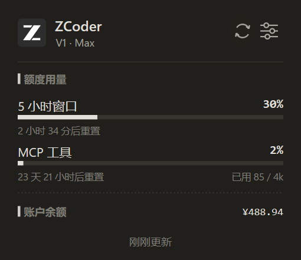
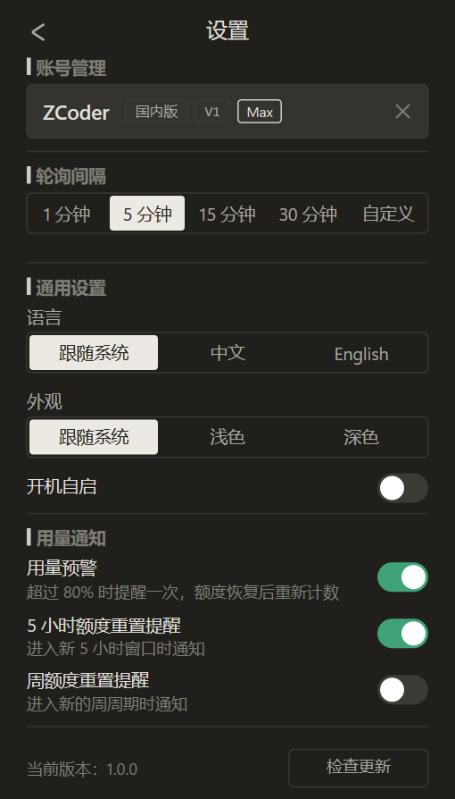

<div align="center">

# Quotify

<a href="https://github.com/TengMMVP/quotify/releases"></a>
<a href="https://www.rust-lang.org/"></a>
<a href="https://github.com/TengMMVP/quotify/releases"></a>
<a href="LICENSE"></a>

</div>

Quotify 是一款常驻 Windows 任务栏托盘的 GLM Coding Plan 用量监控小组件，实时展示 5 小时窗口、周额度、MCP 工具用量与账户余额，帮助你在编码时随时掌握套餐余量、合理安排开发节奏。

## 预览

| 用量面板 | 设置面板 |
| :---: | :---: |
|  |  |

## 特性

- **原生精致**：原生 UI 渲染，无 Electron、无运行时依赖
- **极低开销**：单文件 exe 约 1.5MB；静止时工作集约 5–11MB、零 CPU 占用
- **绿色便携**：免安装，exe 放到任意目录即可运行，配置随行（同目录 `config.toml`），整体搬移不丢状态

## 功能

- **环形托盘图标**：5 小时窗口余量一目了然，颜色随用量档位变化
- **悬停即出面板**：悬停图标即弹出，移开自动收起，点击锁定从容查看
- **完整用量视图**：5 小时窗口、周额度、MCP 工具月度用量、重置倒计时

## 使用

1. **下载运行**：从 [Releases](https://github.com/TengMMVP/quotify/releases) 下载 `Quotify.exe` 放到任意目录，双击即用
2. **添加账号**：悬停托盘图标弹出用量面板 → 点击齿轮进入设置面板 → 填 API key、选择平台即可开始使用
3. **日常查看**：环形图标常驻托盘，颜色即余量档位；悬停看详情，点击锁定面板
4. **配置文件**：所有状态保存在 exe 同目录 `config.toml`，便携可迁移；内含明文 key，请勿分享该文件

## 开发

需要 Windows 与 Rust 1.85+。

```powershell
cargo check              # 快速迭代
cargo test               # 解析层单测
cargo build --release    # 产物 target/release/Quotify.exe
```

## License

本项目遵循 [GPL-3.0](LICENSE) 许可证。
