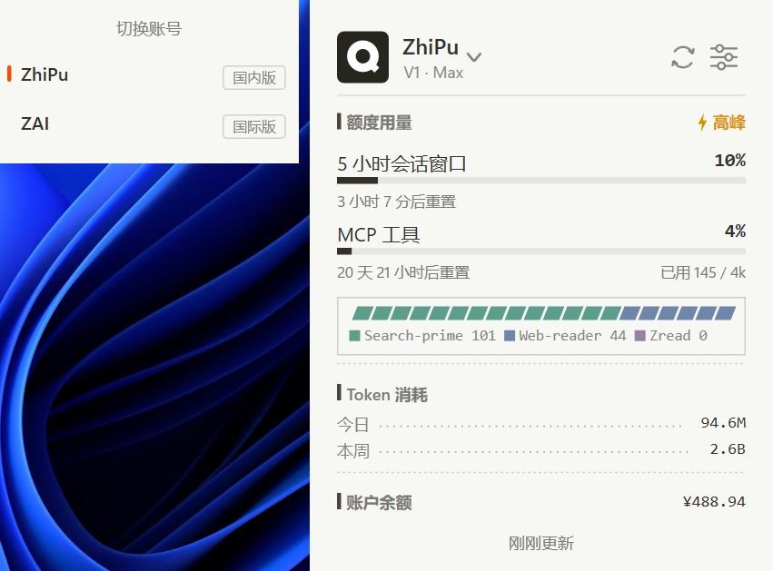
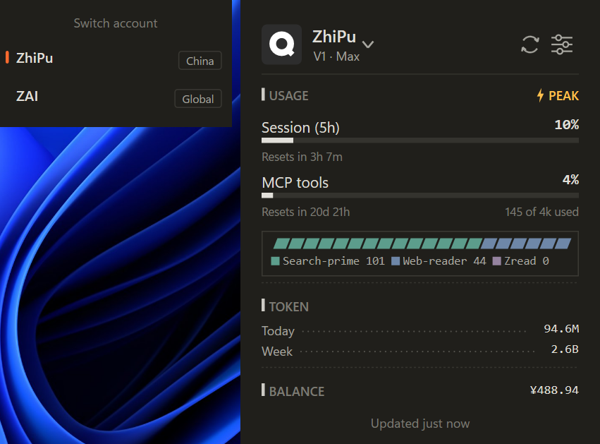
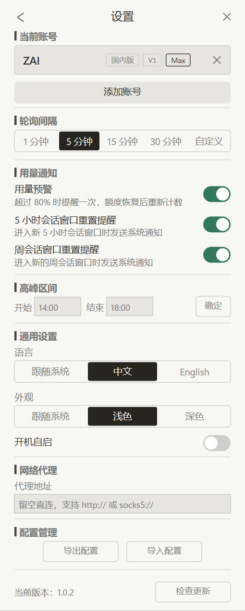
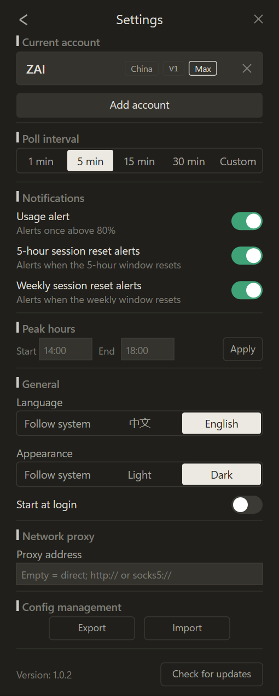

<div align="center">

# Quotify

<a href="https://github.com/tengmmvp/Quotify/releases"></a>
<a href="https://www.rust-lang.org/"></a>
<a href="https://github.com/tengmmvp/Quotify/releases"></a>
<a href="LICENSE"></a>

</div>

> **Quotify 是一款常驻 Windows 任务栏托盘的 GLM Coding Plan 用量监控小组件，实时展示 5 小时窗口、周额度、MCP 工具用量与账户余额，帮助你在编码时随时掌握套餐余量、合理安排开发节奏。**

## 预览

|              |                        浅色                         |                        深色                        |
| :----------: | :-------------------------------------------------: | :------------------------------------------------: |
| **用量面板** |     |     |
| **设置面板** |  |  |

## 特性

- **原生精致**：原生 UI 渲染，无 Electron、无运行时依赖
- **极低开销**：单文件 exe 体积小巧，纯软件渲染不拉起显卡驱动栈，常驻开销极低
- **绿色便携**：免安装，exe 放到任意目录即可运行，配置随行（同目录 `config.toml`），整体搬移不丢状态

## 功能

- **环形托盘图标**：5 小时窗口余量一目了然，颜色随用量档位变化
- **三键分工**：悬停图标出用量摘要，左键打开/收起面板，右键弹出菜单
- **完整用量视图**：5 小时窗口、周额度、MCP 工具月度用量与构成、Token 消耗统计、账户余额、重置倒计时
- **多账号管理**：多账号随时切换，国内/国际双平台
- **用量通知**：阈值预警与 5 小时/周窗口重置提醒，系统通知直达
- **深浅色主题**：跟随系统实时切换，也可手动锁定浅色或深色

## 使用

1. **下载运行**：从 [Releases](https://github.com/tengmmvp/Quotify/releases) 下载 `Quotify.exe` 放到任意目录，双击即用
2. **添加账号**：左键点击托盘图标打开面板 → 点击齿轮进入设置面板 → 选择平台、填 API key 即可开始使用
3. **日常查看**：环形图标常驻托盘，颜色即余量档位；悬停看摘要，左键开面板看详情
4. **配置文件**：所有状态保存在 exe 同目录 `config.toml`，便携可迁移；内含明文 key，请勿分享该文件

## 隐私与数据

- **直连官方**：用量数据只与 GLM 官方 API（国内 `open.bigmodel.cn` / 国际 `api.z.ai`）直连，可自定义代理，不经任何第三方服务器
- **本机明文**：API key 以明文保存在 `config.toml`，无遥测、无云端同步
- **导出文件**：导出的配置同样含明文 key，请妥善保管

## 开发

需要 Windows、Visual Studio C++ 生成工具（MSVC 链接器）与 Rust 1.85+。

```powershell
cargo check              # 快速迭代
cargo test               # 解析层单测
cargo build --release    # 产物 target/release/Quotify.exe
```

## License

本项目遵循 [Apache-2.0](LICENSE) 许可证。
